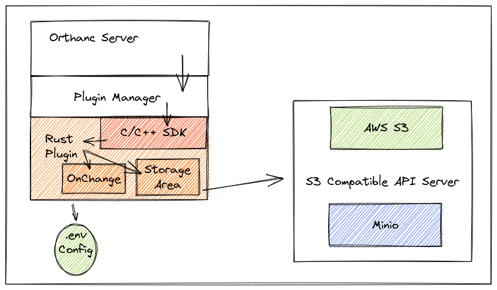

# Orthanc Rust Samples
Orthanc plugin showcasing Rust integration with Orthanc.

- S3 storage (CRUD)
- Change notification



## Concept

This repository showcases how you can use the [Orthanc C/C++ SDK](https://sdk.orthanc-server.com/) to build a [safe](https://doc.rust-lang.org/nomicon/meet-safe-and-unsafe.html) plugin.

The sample makes use of

- [Tokio](https://tokio.rs/) for the async runtime
- [Rusoto](https://github.com/rusoto/rusoto) for the S3 integration
- [Bindgen](https://rust-lang.github.io/rust-bindgen/introduction.html) for code generation from C/C++ headers

## Getting started

### Configuration

A local ".env" file is used to configure the plugin. In the absense of the configuration file, environment variables can be used to specify s3 parameters.

```txt
RUST_LOG="debug"
S3_ENDPOINT="http://localhost:9000"
S3_ACCESS_KEY="minio-root-user"
S3_SECRET_KEY="minio-root-password"
S3_BUCKET="orthanc"
S3_REGION="eu-central-1"
```

### Building the plugin

Using the provided example Makefile you can download and compile orthanc in order to link the Rust plugin.

```bash
make orthanc release
```

### Simulating S3 locally

You can use Docker compose to start a local minio to simulate an endpoint that implements the S3 protocol.
Start the following command in a dedicated terminal session.

```bash
docker compose up
```

### Run the plugin locally

```bash
make run-orthanc
```

http://localhost:8888

The plugin should load. Now simply upload some DICOMs and inspect the logs

You can inspect the S3 contents using the [Minio dashboard](http://localhost:9001/)

### Run the plugin as a Docker container

A sample docker file includes how to run the plugin inside a matching version or Orthanc

```bash
make docker-image run-orthanc-docker

```
or 

```bash
docker run --rm -it --net=host -v $PWD/.env:/.env:ro orthanc-rust-samples:<COMMIT-ID>
```

http://localhost:8888

## Licensing
Created a license because AGPL scares me. ¯\_(ツ)_/¯

These plugins for Orthanc are licensed under the AGPL license.
